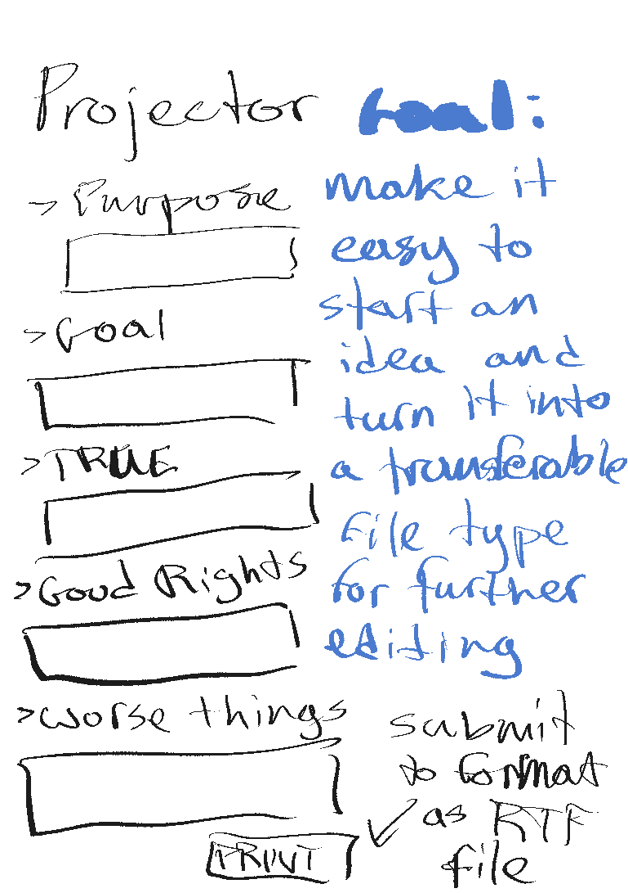
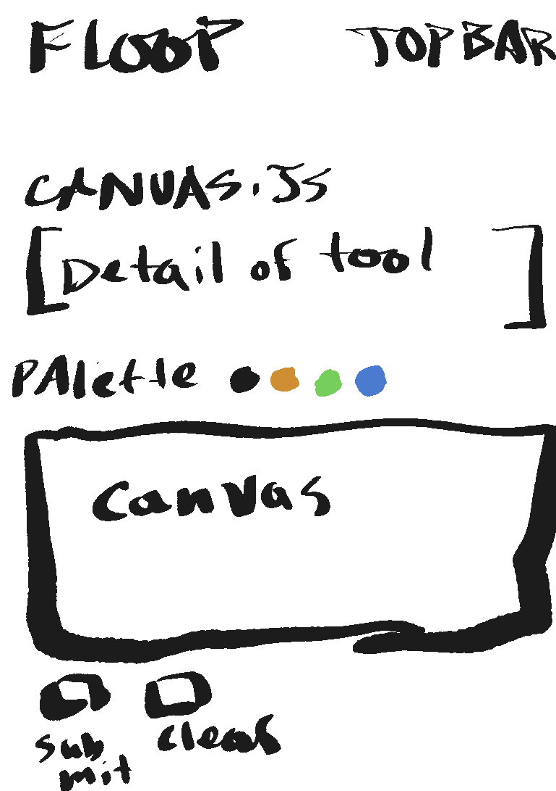
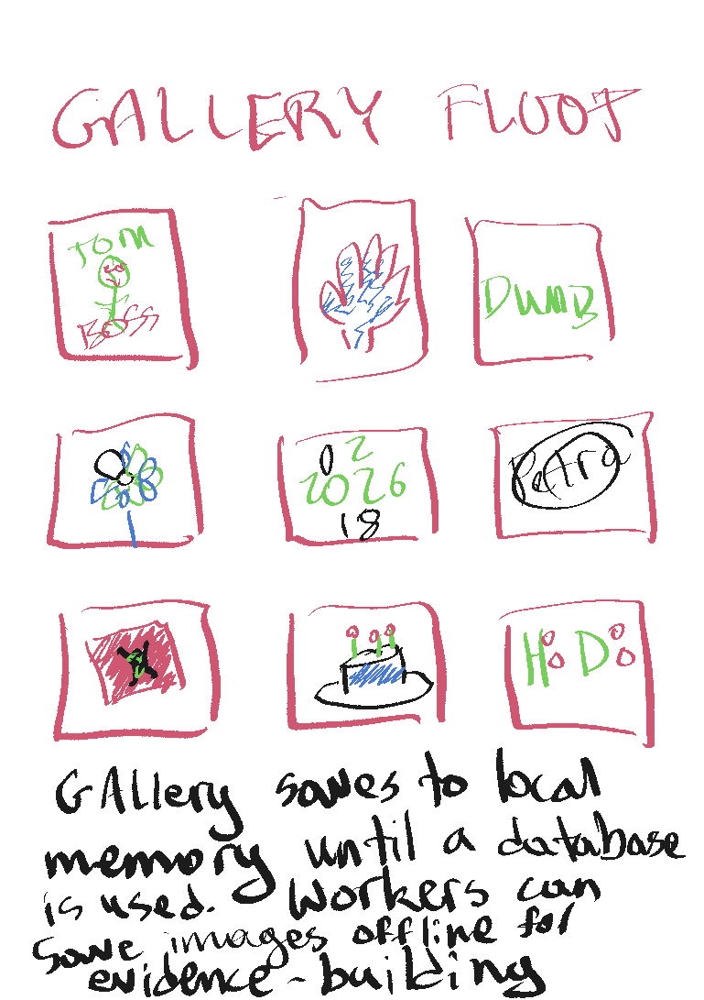
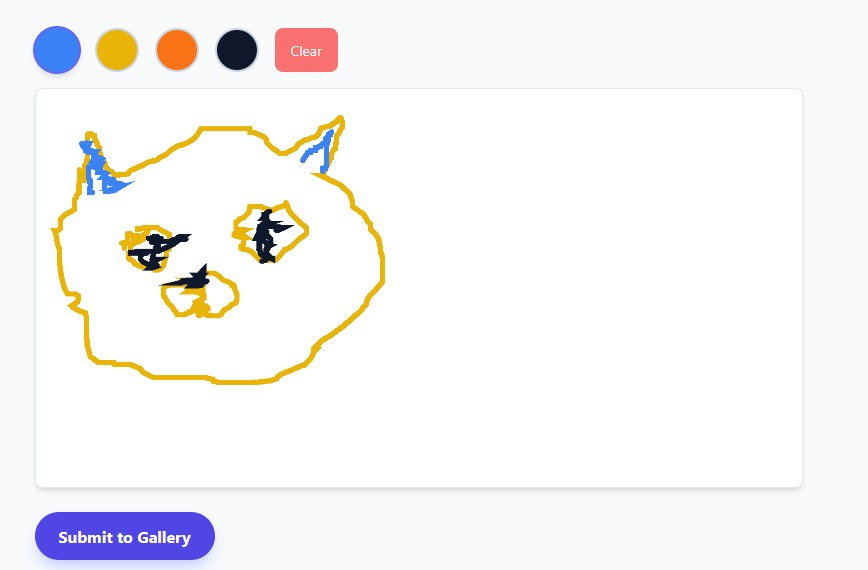
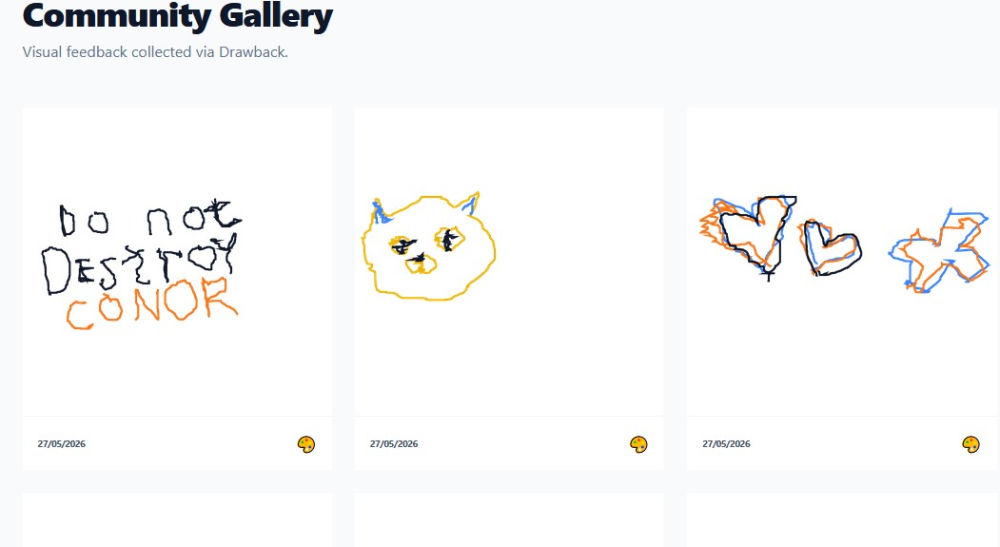
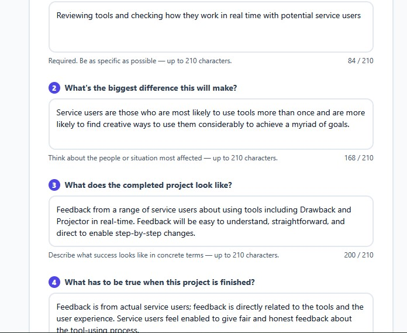
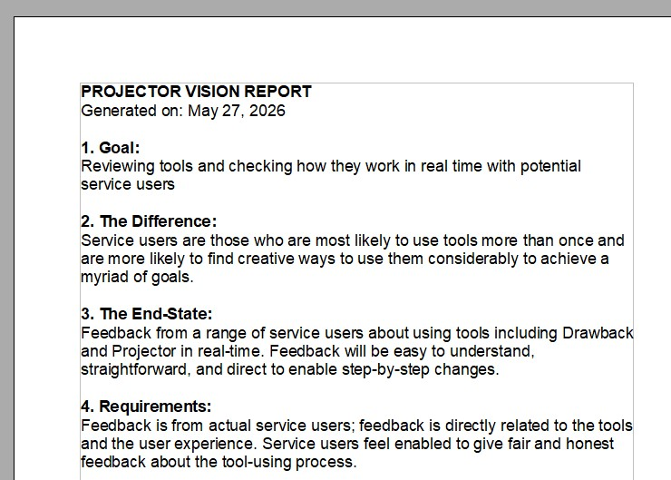
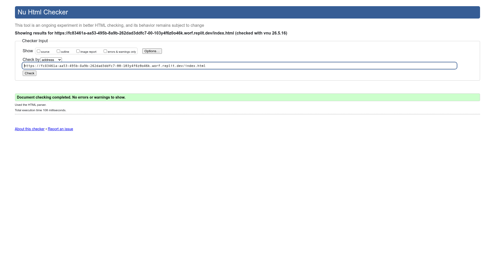
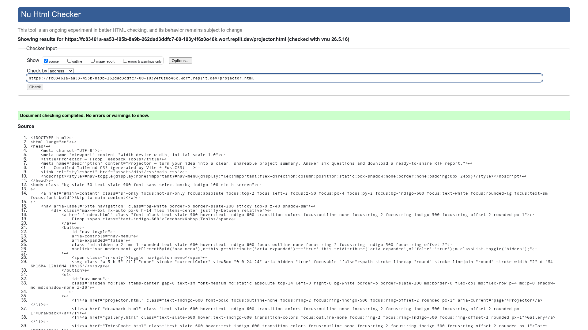
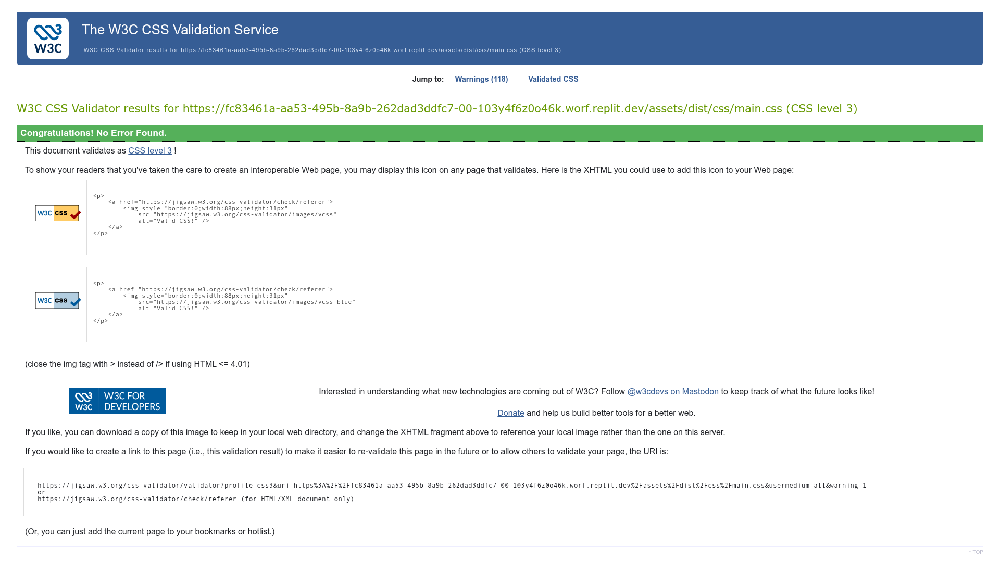

# Floop Feedback Tools

A collection of lightweight, experimental feedback tools designed for young people and adults to share thoughts in creative, low-pressure ways. Built as a Level 5 Diploma project in Web Application Development (2025–2026) at Dudley College by John E. Parman.

---

## Project Rationale

Standard feedback forms were designed for a specific kind of user: someone who reads confidently, types quickly, and feels at ease in formal evaluative contexts. For a large proportion of the people who use educational and community settings — young people, AAC users, people with developmental differences, and anyone who finds formal processes stressful — those assumptions fail completely. The people most likely to benefit from being heard are often the people least likely to be captured by conventional tools.

Floop starts from the opposite direction. Instead of asking "how do we build a better form?", it asks "what kind of micro-interaction genuinely fits this person's situation?" Each tool in the set is designed around one specific need — visual expression, structured ideation, inclusive suggestion — rather than trying to be a general-purpose survey. The modular approach means no single tool has to do everything; it just has to be exactly right for one kind of moment.

### Design philosophy

- **Low cognitive load** — Every tool limits text, reduces decision points, and presents only what is needed at that step. Nothing is left open-ended in a way that creates anxiety.
- **Mobile-first interaction** — Touch targets are large, layouts are single-column, and interactive elements are designed around finger use rather than mouse precision.
- **Inclusive and AAC-aware design** — At least one tool (Drawback) is usable without any text input at all. The AAC page surfaces background knowledge for facilitators who may not be familiar with alternative communication methods.
- **Modular micro-interactions** — Each tool is a standalone page. Facilitators can open exactly the tool that fits their session without requiring participants to navigate a larger system.

This project was developed as part of a Level 5 Diploma in Web Application Development (2025–2026) at Dudley College. Its purpose is to explore whether modular, micro-interaction-based feedback tools can genuinely serve audiences that conventional forms exclude.

### Target audiences

#### AAC users and people with communication differences

People who use Augmentative and Alternative Communication devices, picture-based communication systems, or a combination of verbal and non-verbal communication. They may find text-heavy forms inaccessible, slow, or impossible to complete independently. Their unmet need is a feedback route that does not require typing or reading, and that produces a meaningful output — a drawing, a visual record — they can share without translation.

#### Young people and students who find formal feedback stressful

Students in school, college, or youth provision settings who experience anxiety, low confidence, or disengagement around formal evaluation tasks. Spelling concerns, fear of "wrong answers", and the pressure of written expression are common barriers. Their unmet need is a feedback experience that feels creative and low-stakes rather than assessed, with no requirement to produce grammatically correct text.

#### Facilitators, teachers, and youth workers running group sessions

Adults leading workshops, lessons, or group activities who need lightweight feedback tools that the whole group can use on shared or personal devices, without requiring training, logins, or technical support. Their unmet need is something they can open on a tablet or laptop, hand to a participant, and trust to work — with outputs they can collect, discuss, or act on immediately.

---

## Tools and Pages

| File | Name | Description |
|------|------|-------------|
| `index.html` | Hub | Landing page listing all tools with brief descriptions. |
| `projector.html` | Projector | A six-question form that helps users articulate a project idea. Answers are saved locally and downloaded as a ready-to-share RTF report. |
| `Projectourist.html` | Projectourist | A local gallery of previously saved Projector entries, with per-card RTF re-download. |
| `drawback.html` | Drawback | A minimalist HTML5 canvas drawing tool with a four-colour palette. Drawings are saved to localStorage and visible in the Gallery. |
| `gallery.html` | Gallery | Displays all drawings saved via the Drawback tool from the user's browser localStorage. |
| `TotesEmote.html` | Totes Emote | A sandbox combining emoji sentiment selection with a freehand drawing canvas — an early prototype for visual feedback. |
| `suggest-tool.html` | Suggest a Tool | An eight-question form (three sections) where users can submit ideas for new Floop tools. Submissions are sent to a Google Sheets endpoint and also saved locally. |
| `aac.html` | About AAC | An informational page about Augmentative and Alternative Communication — what it is, types, who uses it, key principles, and trusted external resources. Includes four embedded YouTube videos. |
| `kwacart.html` | KwaCart | A description of a separate Django-based facilitation platform (Milestone Project 3) built around Liberating Structures methodology. |
| `about.html` | About | Project credits, creator information, and a LinkedIn link. |
| `wireframe.html` | Site Wireframes | A visual site map of every page, showing layout, structure, and planned content. |

---

## Wireframes

Hand-drawn sketches produced during the design phase, showing the intended layout and structure of the key interactive tools.

**Projector** — six-question form with RTF download



**Drawback** — HTML5 canvas drawing tool



**Gallery** — grid of saved Drawback drawings



---

## Running Locally

The app is served by a simple Python HTTP server:

```bash
python server.py
```

Runs on `0.0.0.0:5000`. Open `http://localhost:5000` in your browser.

All data is stored in browser `localStorage` — there is no backend.

### React build step

The Drawback, Gallery, and Totes Emote pages use React. Their JSX source files live in `src/` and are compiled at build time using Vite. The compiled bundles are committed to `assets/js/dist/` and served as static files — no runtime JSX compilation occurs.

To rebuild after editing a source file in `src/`:

```bash
npm run build
```

This writes compiled output to `assets/js/dist/`. The Python server does not need to restart.

---

## Deployment

Configured as a static site deployment with `publicDir: "."`. All files at the project root are served directly. No server-side processing is required.

---

## Project File Structure

```
/
├── index.html              — Hub / landing page
├── projector.html          — Projector tool
├── Projectourist.html      — Projector gallery
├── drawback.html           — Drawback drawing tool
├── gallery.html            — Drawback gallery
├── TotesEmote.html         — Emoji + drawing sandbox
├── suggest-tool.html       — Suggest a Tool form
├── aac.html                — About AAC information page
├── kwacart.html            — KwaCart project description
├── about.html              — About page
├── wireframe.html          — Site wireframes
├── server.py               — Python HTTP server for local development
├── assets/
│   ├── css/
│   │   ├── style.css       — Global shared stylesheet (project code)
│   │   └── wireframe.css   — Wireframe page styles (project code)
│   ├── js/
│   │   ├── dist/           — Compiled React bundles (output of `npm run build`; do not edit)
│   │   │   ├── drawback.js
│   │   │   ├── gallery.js
│   │   │   ├── totes-emote.js
│   │   │   └── shared-*.js — Shared React/ReactDOM chunk
│   │   ├── drawback.js     — Legacy source (superseded by src/drawback.jsx; no longer loaded)
│   │   ├── gallery.js      — Legacy source (superseded by src/gallery.jsx; no longer loaded)
│   │   ├── projector.js    — Projector form logic, RTF generation, localStorage (project code)
│   │   ├── suggest-tool.js — Suggest-a-tool form logic, Google Apps Script endpoint (project code)
│   │   └── script.js       — Legacy character counters and RTF generation (project code)
│   └── img/                — Screenshot images
├── src/                    — JSX source files compiled by Vite
│   ├── drawback.jsx        — Drawback React component source
│   ├── gallery.jsx         — Gallery React component source
│   └── totes-emote.jsx     — Totes Emote React component source
├── vite.config.js          — Vite build configuration
```

---

## External Dependencies

Every `<script>` and `<link>` tag that loads an external resource in an HTML file has a comment directly above it naming the library and linking to its source.

### Tailwind CSS (via CDN)
- **Source:** https://cdn.tailwindcss.com
- **Version:** Latest (CDN auto-resolves)
- **Used in:** `index.html`, `projector.html`, `Projectourist.html`, `drawback.html`, `gallery.html`, `TotesEmote.html`, `suggest-tool.html`, `aac.html`, `about.html`, `kwacart.html`, `wireframe.html`
- **Purpose:** Utility-first CSS framework used for all layout, typography, and component styling. This is an external library — not project code.

### React 18 and ReactDOM 18 (npm, bundled by Vite)
- **Source:** https://www.npmjs.com/package/react / https://www.npmjs.com/package/react-dom
- **Version:** 18 (installed via npm)
- **Used in:** `src/drawback.jsx`, `src/gallery.jsx`, `src/totes-emote.jsx`
- **Purpose:** UI component library and DOM renderer. Imported directly in the JSX source files and compiled into `assets/js/dist/` by Vite at build time. React is no longer loaded from a CDN at runtime. This is an external library — not project code.

### YouTube Privacy-Enhanced Player
- **Source:** https://www.youtube-nocookie.com (Google / YouTube)
- **Used in:** `aac.html` (4 embedded videos)
- **Purpose:** Embeds educational AAC videos from public YouTube channels. The `youtube-nocookie.com` domain is YouTube's privacy-enhanced mode, which does not set cookies until the user plays a video. Content is hosted and served entirely by YouTube/Google — not project code.
- **Video IDs:** `r3m8_YmTDDM`, `qB2Fk0KdUuo`, `IzmOlD2CaG8`, `-MQT0DYxgAE`

### Google Apps Script Endpoint
- **Source:** https://script.google.com (Google)
- **Used in:** `assets/js/suggest-tool.js` (the `SHEETS_URL` constant)
- **Purpose:** Receives form submissions from the Suggest a Tool page and appends them as rows to a Google Sheet. This is a third-party service — the integration point is documented inline in `suggest-tool.js`.

---

## User Stories

### 1 — Drawing and sharing visual feedback as an AAC user

**Audience:** AAC users and people with communication differences

> "I communicate using a mix of verbal speech, symbols, and a speech-generating device. Before Drawback, every feedback tool I encountered was text-heavy — I'd lose the thread halfway through, and it took so long that the moment had passed. I needed something where I could just draw what I mean and share it, without anyone having to translate for me."

Before: Conventional feedback forms require reading prompts, typing responses, and navigating multi-step interfaces — each of which creates a separate barrier for someone who communicates primarily through symbols or a device. Most tools were unusable without significant support from another person.

After: Drawback gives AAC users a single canvas with four distinct colours and no instructions to read. Picking a colour and drawing requires no text input and no typing. When the drawing is ready, one tap sends it to the Community Gallery where it sits alongside contributions from everyone else — no labels, no names, just the image. The flow respects all communication styles: verbal, non-verbal, and device-assisted users can all complete it independently.

**Drawback — the drawing canvas**



**Community Gallery — where submitted drawings appear**



---

### 2 — Turning a flood of ideas into a shareable project summary

**Audience:** Young people and adults with many ideas who struggle to communicate them concisely

> "I have about fifteen ideas on the go at any time and I struggle to explain any of them quickly. People's eyes glaze over. Before Projector, my ideas lived in scattered notes, half-conversations, and my own head — I never had anything I could actually hand to someone. I needed something that would force me to structure one idea at a time."

Before: Without a structured prompt, it is easy to over-explain, go off-topic, or assume shared context that the listener doesn't have. Blank documents and note apps offer no constraints, so ideas stay vague. The result is that promising projects never get communicated clearly enough to attract support or collaboration.

After: Projector walks through six focused questions — what the project is, what difference it will make, what done looks like, who it is for, what support it needs, and the next step. Each answer has a 210-character limit that keeps responses concise without being dismissive. When the form is submitted the tool generates a ready-to-download RTF file named after the project title. That file opens in any word processor for further editing and formatting, and builds over time into a portfolio of concrete project outlines rather than a list of half-remembered ideas.

**Projector — six questions, one clear project summary**





---

## Testing

### Principles of automated and manual testing

A robust testing strategy combines automated and manual approaches, each suited to different kinds of question.

#### Automated testing

A test runner executes a suite of coded checks on demand and reports pass or fail instantly. The same suite can run after every edit, in a CI pipeline, or before a deployment, at negligible cost.

**Best suited to:**

- **Regression checking** — once a behaviour is encoded as a test, any future change that breaks it is caught before it reaches users.
- **Logic with clear inputs and outputs** — functions that transform data (generating an RTF string, counting characters, validating a field) are ideal because the expected result can be stated precisely.
- **Structural contracts** — confirming that every page has a `<title>`, a `<main>` landmark, correct heading hierarchy, and a viewport meta tag is fast to write and catches regressions that are otherwise invisible to developers.
- **High-frequency repetitive checks** — anything too tedious to verify by hand on every change (scanning all pages for missing ARIA attributes, for example) is worth automating.

**Limitation:** automated tests only verify what they were written to test. They cannot judge whether a layout feels right, whether tap targets are large enough, or whether the experience makes sense to a first-time user.

#### Manual testing

A tester deliberately exercises the software — following realistic user journeys, trying edge cases, and forming a judgement about whether the product works as intended.

**Best suited to:**

- **Usability and experience** — only a person can judge whether a tool is intuitive, whether the flow feels low-pressure, or whether the language is clear.
- **Visual and responsive design** — confirming that a layout reflows correctly on a 375 px screen, that nothing overlaps, and that touch targets are comfortably sized requires looking at the rendered page.
- **Accessibility in practice** — automated tools detect missing `alt` text or an incorrect ARIA role, but keyboard navigation and screen-reader testing confirm whether the experience is genuinely usable without a mouse.
- **Exploratory testing** — trying unanticipated combinations (submitting the form with only whitespace, drawing and immediately clearing, opening the gallery with an empty localStorage) surfaces real-world edge cases.
- **Cross-browser and cross-device checks** — rendering differences between browsers and operating systems are caught by using the site on real or emulated devices.

**Limitation:** manual testing is slow, does not scale, and is inconsistent between sessions. It cannot replace automated regression checking for logic and structure.

#### How both are used in this project

Automated tests (Jest) cover everything that can be stated precisely — JavaScript logic, HTML structure, landmark presence, and page-level contracts. Manual testing covers everything that requires human judgement: layout, usability, responsiveness, accessibility in practice, and cross-device behaviour. W3C validation and JSHint linting complement both: they verify adherence to published standards, catching malformed markup and problematic JavaScript patterns that neither Jest nor manual review is designed to find.

---

### Automated test results

Automated tests (Jest) cover JS utility logic and full HTML structure checks. All 164 tests pass.

```bash
npm test              # all 164 tests
npm run test:unit     # unit tests (RTF generation, counters, validation)
npm run test:e2e      # HTTP/cheerio E2E tests (page structure, landmarks, responsiveness)
```

Full documented test results — including manual usability and responsiveness checks, screenshots of every page, bugs found and resolved during testing, and a development-vs-deployment parity assessment — are in **[TEST_RESULTS.md](TEST_RESULTS.md)**.

---

## Validation

All HTML pages, the compiled CSS stylesheet, and both JavaScript files were validated using industry-standard tools on 16 May 2026. Every file passes with zero errors and zero warnings.

### W3C Nu HTML Checker

Eight pages were submitted to the [W3C Nu Html Checker](https://validator.w3.org/nu/):

| Page | Result |
|---|---|
| `index.html` | No errors or warnings |
| `projector.html` | No errors or warnings |
| `drawback.html` | No errors or warnings |
| `gallery.html` | No errors or warnings |
| `aac.html` | No errors or warnings |
| `suggest-tool.html` | No errors or warnings |
| `about.html` | No errors or warnings |
| `404.html` | No errors or warnings |

Issues found and fixed during the validation pass:

- Removed `role="list"` from all navigation `<ul>` elements (redundant on native list elements)
- Removed obsolete `frameborder="0"` attribute from four YouTube `<iframe>` elements in `aac.html`
- Removed redundant `aria-required="true"` from `<input required>` elements in `projector.html`
- Removed trailing slashes from void elements (`<input>`, `<hr>`) in `suggest-tool.html`

**W3C HTML validation — index.html (No errors or warnings)**



**W3C HTML validation — projector.html (No errors or warnings)**



### W3C CSS Validation Service

The compiled stylesheet `assets/dist/css/main.css` was submitted to the [W3C CSS Validation Service](https://jigsaw.w3.org/css-validator/) against the CSS level 3 profile. No errors were found.

**W3C CSS validation — main.css (No errors found)**



### JSHint

Both hand-written JavaScript files were linted with [JSHint](https://jshint.com/) using the project-root `.jshintrc` (`esversion: 6`, `browser: true`, `undef: true`, `unused: true`). Neither file produced any errors or warnings.

```
$ npx jshint assets/js/projector.js assets/js/suggest-tool.js
(no output — zero errors)
```

---

## Contributing

When adding a new page, JS file, or external dependency, follow the step-by-step checklist in **[CONTRIBUTING.md](CONTRIBUTING.md)**. It covers every documentation update required — Tools and Pages table, Project File Structure, External Dependencies, inline attribution comments, and dependency comment blocks — so the README stays accurate as the project grows.

---

## Code Attribution

### Code written for this project

The following files were written entirely for the Floop Feedback Tools project by John E. Parman. No external source code has been copied into any of them.

| File | Description |
|---|---|
| `index.html` | Hub landing page — HTML structure, navigation, and tool card grid |
| `projector.html` | Projector form — HTML structure and form markup |
| `Projectourist.html` | Projectourist gallery page — HTML structure and inline gallery/RTF script |
| `drawback.html` | Drawback page — HTML shell that mounts the React component |
| `gallery.html` | Gallery page — HTML shell that mounts the React component |
| `TotesEmote.html` | Totes Emote page — HTML shell that mounts the React component |
| `suggest-tool.html` | Suggest a Tool form — HTML structure and form markup |
| `aac.html` | About AAC — HTML structure and informational content |
| `kwacart.html` | KwaCart description page — HTML structure |
| `about.html` | About page — HTML structure and credits |
| `wireframe.html` | Site wireframes — HTML structure and all wireframe card content |
| `404.html` | 404 error page — HTML structure |
| `assets/js/projector.js` | Projector form logic — character counters, RTF generation, localStorage |
| `assets/js/suggest-tool.js` | Suggest-a-Tool form logic — counters, checkboxes, Google Sheets submission |
| `assets/js/projectourist.js` | Projectourist gallery logic — localStorage read, card rendering, RTF re-download, delete |
| `assets/js/404.js` | 404 page countdown timer and automatic redirect to index.html |
| `src/drawback.jsx` | Drawback React component — canvas drawing logic and UI |
| `src/gallery.jsx` | Gallery React component — localStorage read and drawing grid |
| `src/totes-emote.jsx` | Totes Emote React component — emoji picker and drawing canvas |
| `assets/css/style.css` | Supplementary CSS for canvas and layout rules |
| `assets/css/wireframe.css` | Grid-paper background and wireframe placeholder box styles |
| `assets/css/totes-emote.css` | Page-specific mobile overscroll rule for TotesEmote.html |
| `vite.config.js` | Vite build configuration — multi-entry JSX compilation |

Every file that references an external library or service has an attribution comment immediately above the relevant line, identifying the source and its URL.

### Code from external sources

No source code from any external library or tutorial has been pasted into project files. All external dependencies are consumed through their published interfaces (npm packages, CDN links, or service APIs). Each is documented in the [External Dependencies](#external-dependencies) section and attributed at the point of use in the relevant source file.

| Dependency | Source | How used |
|---|---|---|
| Tailwind CSS | [tailwindcss.com](https://tailwindcss.com) | Utility classes in HTML; compiled to `assets/dist/css/main.css` at build time via Vite + PostCSS |
| React 18 | [react.dev](https://react.dev) | Imported in JSX source files; bundled by Vite into `assets/dist/js/` — not loaded at runtime from a CDN |
| ReactDOM 18 | [react.dev](https://react.dev) | `createRoot` DOM renderer; bundled alongside React by Vite |
| YouTube embeds | [youtube-nocookie.com](https://www.youtube-nocookie.com) | Four `<iframe>` elements in `aac.html`; content hosted entirely by YouTube/Google |
| Google Apps Script | [script.google.com](https://script.google.com) | Endpoint that receives Suggest-a-Tool form submissions and writes them to a Google Sheet |

Facilitation methodology described on `kwacart.html` draws on **Liberating Structures**, created by Henri Lipmanowicz and Keith McCandless — see [liberatingstructures.com](https://www.liberatingstructures.com).
